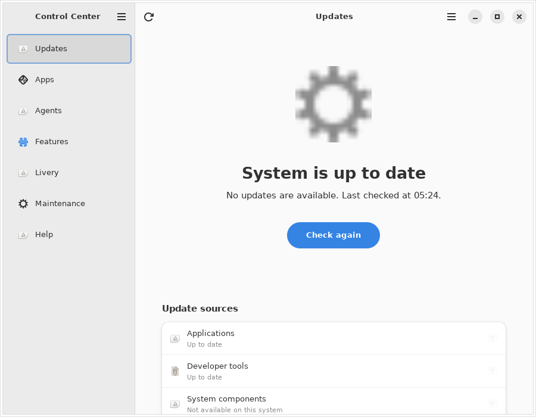
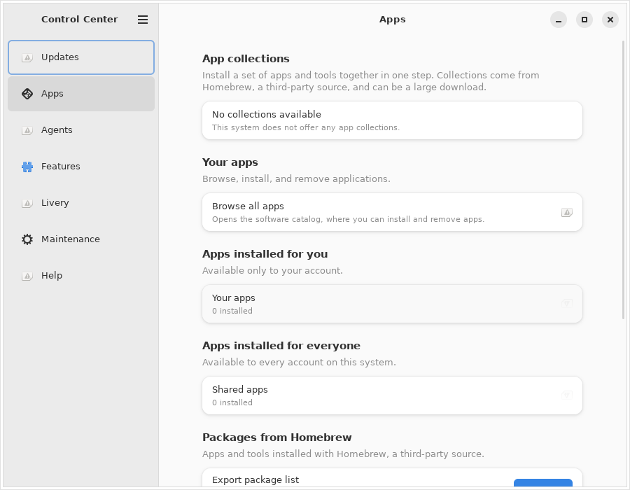
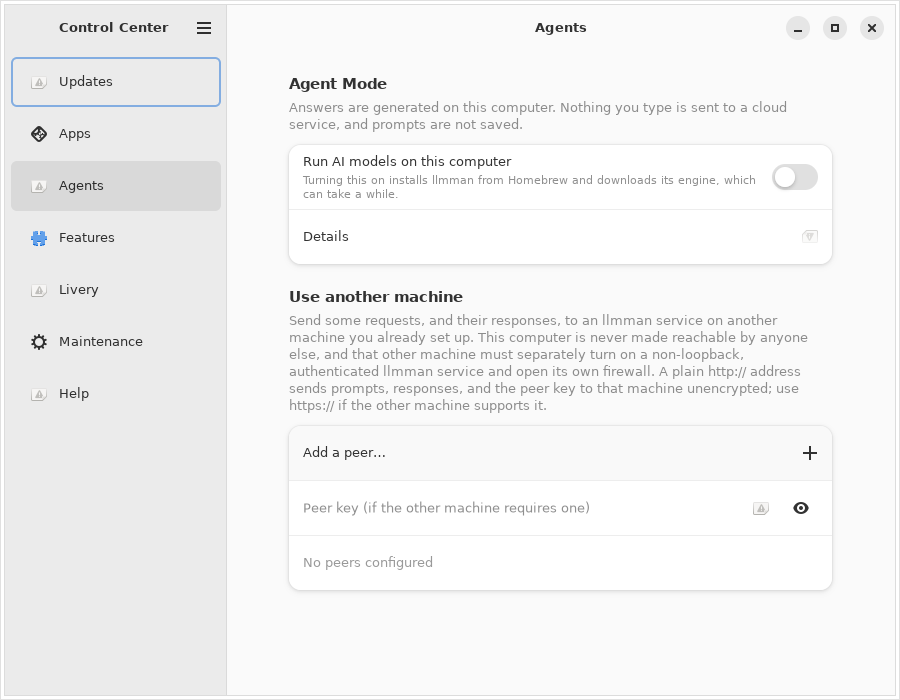
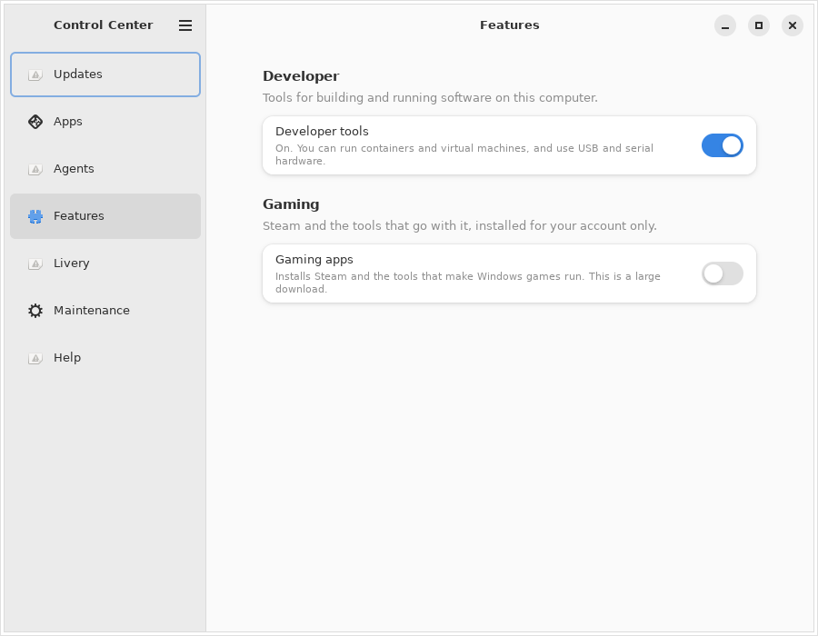
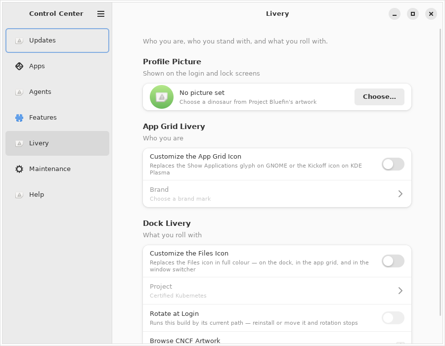
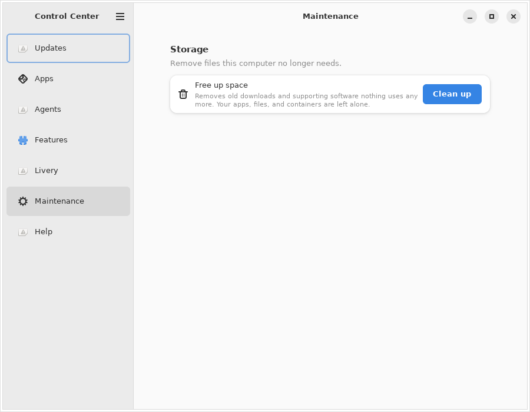
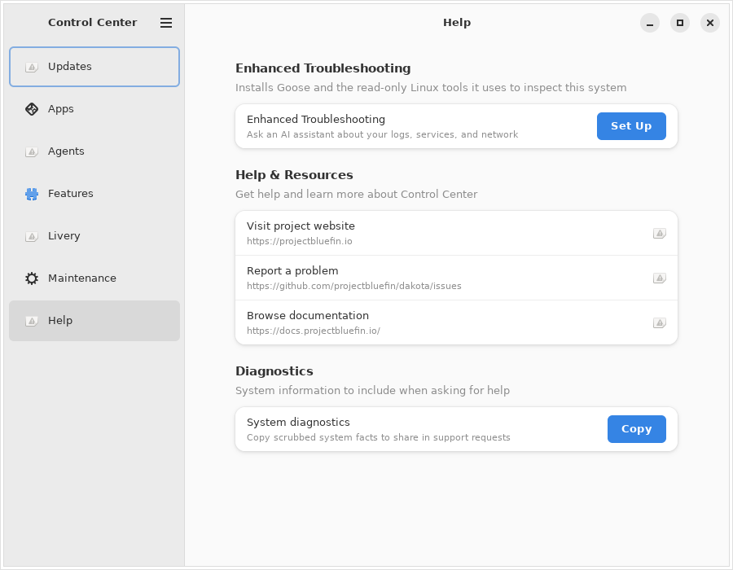

# Control Center walkthrough

Every screen in Control Center, captured from the real app by `make
screenshots` (see [below](#how-these-are-made)) — not mockups.

One app for the Bluefin family (Bluefin, Bluefin LTS, Dakota).
Everything here is one control per decision — no strategy pickers, no
schedule choosers, no feature grids.

---

## Updates



The page leads with where you stand: **System is up to date**, or how many
updates are waiting. Below that, **Update sources** lists the four things
that can be updated — Applications, Developer tools, System components, and
Operating system — each with its own state, so you can see which one is
holding you up without opening anything.

One button covers all of them. It reads **Check again** when nothing is
pending, **Update all** when something is, **Retry failed** if a source
didn't finish, and **Restart now** once a new system version is staged and
waiting. It only asks you to restart when something actually needs one, and
a source that fails doesn't stop the others. A run long enough that you
wandered off finishes with a desktop notification.

**Automatic updates** is the one switch for whether this system keeps itself
up to date in the background. It appears only on systems that ship the
unattended-update timer, and it's a choice about the future — updating right
now is the button above.

Further down, each source keeps its own group for when you want to update
just one thing: **Apps** lists the Flatpak updates waiting, and **Developer
tools** lists the command-line tools you installed with Homebrew.

**System Updates** adds **What's Changing**, which lists exactly what software
a pending update will add, remove, or upgrade. That group only appears on
systems that update as a whole, so it's not in the shot above. **Roll Back** —
returning to the previous version if an update went badly — lives under
**Recovery**, and only appears where a previous deployment actually exists.

The same page holds the two choices that replace the operating system itself,
because both land through an update and both need a restart.
**Release Channel** switches between the stable version and the early one, and
**Graphics Driver** switches you to the NVIDIA driver if your card wants it.
Neither appears unless there is actually something to switch to. Above them,
a compact line says what's installed now and what's queued for the next
restart; the exact build identifiers sit behind **Details** for when you need
to quote them in a bug report.

If a Homebrew package came from an unofficial source, the page asks you to
trust that source before it will keep updating it.

There is no separate System page. What this computer *is* — its name, memory,
disk, and hardware — is GNOME Settings' job, and Control Center does not
duplicate it.

---

## Apps



**App collections** lead the page: install a set of apps and tools together in
one step, rather than hunting them down one at a time. Collections come from
Homebrew, a third-party source, and can be a large download — the page says so
once, at the top, instead of nagging on every row.

Below that sit the apps already installed, the packages Homebrew manages, and
a search across both. **Export package list** saves what you have installed so
you can put it back on another machine.

---

## Agents



**Agent Mode** is one switch that runs AI models on this computer. Answers are
generated locally — nothing you type is sent to a cloud service — and prompts
are not saved. Turning it on installs the llmman model server from Homebrew
(and, on x86_64 PCs, the Jan chat app), downloads the engine that suits your
hardware, and starts it on this computer only. Turning it off stops the
server and keeps the software and any models you downloaded.

**Details** gives the address other apps can reach it on. Apps and terminals
opened after Agent Mode is on find it automatically through `OLLAMA_HOST`;
ones already open need restarting. Everything here runs in your own account,
so it never asks for an administrator password.

---

## Features



**Developer tools** lets you run containers and virtual machines, and use USB
and serial hardware, without being asked for permission each time. It needs
your administrator password, and takes effect after you log out and back in.
A distribution may also configure it to install the Pulp feed reader and stage
a curated list of developer feeds in your home folder once you switch it on —
both are off by default, and turning Developer tools back off never removes the
reader, the file, or anything you imported from it.
**Gaming** is a switch: on installs Steam and the tools that make Windows
games run, off removes them again. On an image that already ships them, the
page says so instead of offering a switch that would do nothing.
**Enhanced Troubleshooting** sets up an AI assistant that can read your logs,
services, and network to help work out what's wrong, then launches it — the
row says which AI service answers your questions, since the default one is
Google's. It is only offered where Homebrew is installed, so it's not in the
shot above. **Optional features** is the distribution's own feature manager,
and is empty where the distribution ships none.

Agent Mode has its own **Agents** page.

---

## Livery



Who you are, who you stand with, and what you roll with.

**Profile Picture** is the picture on your login and lock screens. Pick one of
Project Bluefin's dinosaurs and Control Center downloads that one illustration
to preview it; nothing changes until you press Apply. If the download or the
change fails, the chooser says so and your old picture stays put. Where
AccountsService is unavailable the picture is saved to your home folder
instead and appears after you next sign in, and the confirmation says which of
the two happened.

**App Grid Livery** is your own mark on the Show Applications button. Search
all 3,461 brands [Simple Icons](https://simpleicons.org/) publishes — your
project, your employer, whatever you answer to — and Control Center fetches it
and rebuilds the dock so it appears straight away. You set it once; it never changes on its own, because a personal mark that
rotated would stop being personal.

**Foundational Livery** puts a foundation's mark in the top bar: CNCF, the
Linux Foundation, GNOME, freedesktop.org, Apache, Rust, Universal Blue,
Bazzite, Aurora, or the Open Gaming Collective. On a gaming image the
collective's mark is the one you start with, since that is whose work the
image ships — pick any other and it stays picked.

**Dock Livery** is the project you actually work on. Every CNCF project that
publishes artwork is in the list — 214 of them, Kubernetes through bootc — so
the picker searches rather than scrolls, and each one arrives as the project's
own colour icon straight from
[cncf/artwork](https://github.com/cncf/artwork).

Both can **Rotate at Login**, which moves one step down the list each time you
sign in — so you stand somewhere slightly different every day without ever
picking again.

Any section will also take an SVG of your own, which is the way in for
anything not on the list.

Three things worth knowing. The top-bar section needs the Custom Command Menu
GNOME extension; without it the section is not shown at all rather than
offering a control that does nothing. The Files mark is the Files mark
everywhere — the dock, the app grid, the window switcher — because GNOME keeps
one icon per app, not one per place, and the app-grid glyph is shared the same
way. And only the Files icon is in colour: the top bar and the app grid draw
single-colour silhouettes, recoloured to match your theme, which is how every
other icon up there behaves.

Turning a section off puts back exactly what was there before, including a
mark your distribution set rather than one you chose.

---

## Maintenance



One button. **Free up space** removes old downloads and supporting software
nothing uses any more, and leaves your apps, files, and containers alone. It
tells you how much it reclaimed only when it could measure it. Below it sit
any **Maintenance tasks** whoever set up this computer added. **Recovery**
holds the actions you can't undo (under **Maintenance → Recovery**): one returns
to a previous system version, one removes the apps you installed and your
development containers, and the other reinstalls the system from scratch.
Those stay hidden normally until turned on or until a rollback exists.
Recovery also has **Published versions**, which asks the image registry for
the versions of your release stream from the last 90 days and lists one per
day, marking the one you are running and the one Roll Back returns to. It is a
list to read, not a control: nothing in it changes your system.

---

## Help



Three links, each shown only when it is configured: **Website**, **Report a
problem** (the `issues` URL, where bug reports go), and **Documentation**.

When the configuration turns on something this computer cannot run — Flatpak
or Homebrew is absent, or the machine is not a native A/B install — **Feature
availability** appears with one collapsed row, **Why is something missing?**,
that names each such feature and what it needs.

---

## How these are made

```bash
make screenshots
```

Builds the app, runs it headless under Xvfb, and writes one cropped PNG per
page to `docs/screenshots/`. Always `--dry-run`, so nothing on the capture
machine changes. Hardware the runner doesn't have is stubbed, and `make ci`
checks no released binary can read those stubs.

Run it locally when something's appearance changes and you want to preview
before a release. It isn't regenerated per commit, since font and theme
drift would churn the repo — instead, `.github/workflows/release-screenshots.yml`
runs it automatically after each published GitHub Release (building from that
release's tag) and opens a `release-screenshots` pull request against `main`
with any changed PNGs, so what ships is what's pictured here without anyone
remembering to do it by hand. That pull request goes through the merge queue
like any other and still needs one approval. `make ci` checks
that every page and configurable group has a screenshot and an entry here.
