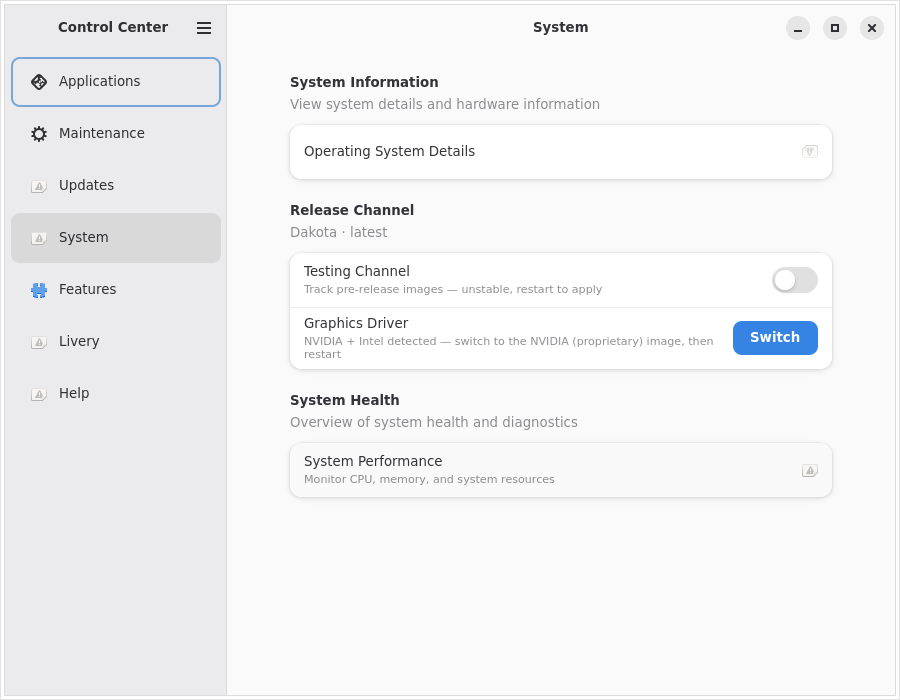
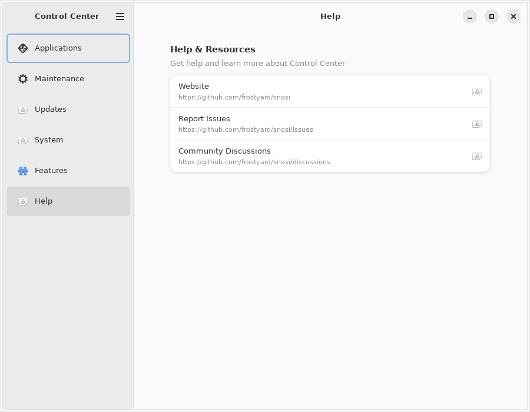

# ChairLift walkthrough

Every screen in ChairLift, captured from the real app by `make screenshots`
(see [below](#how-these-are-made)) — not mockups.

One app for Snow Linux and the Bluefin family (Bluefin, Bluefin LTS, Dakota).
Everything here is one control per decision — no strategy pickers, no
schedule choosers, no feature grids.

---

## Updates


**Update All** updates your system, your apps, and your packages in one
click, and tells you when it's done. It only asks you to restart if something
actually needs one. **Automatic Updates** keeps everything up to date in the
background. The Flatpak and Homebrew groups below let you update just one
thing if you prefer.

**System Updates** adds **Roll Back**, which returns you to the previous
version if an update went badly, and **What's Changing**, which lists exactly
what software a pending update will add, remove, or upgrade. That group only
appears on systems that update as a whole, so it's not in the shot above.

---

## System



Your system details, what's installed now, and what's queued for the next
restart. **Release Channel** switches between the stable version and the
early one. **Graphics Driver** switches you to the NVIDIA driver if your card
wants it. Neither appears unless there's actually something to switch to.
**Mission Center** opens the system monitor.

---

## Features


**Developer Mode** gives your account access to containers, virtual machines,
and serial devices. **Gaming Mode** installs Steam and the tools that make
games run well. **Local AI** runs an AI model on your own machine instead of
in the cloud, using your graphics card if you have one — the first start
downloads several GB. **Enhanced Troubleshooting** sets up an AI assistant
that can read your logs, services, and network to help work out what's wrong,
then launches it — the row says which AI service answers your questions,
since the default one is Google's. **System Features** is Snow Linux's
feature manager, and is empty elsewhere.

---

## Applications


Your installed apps and Homebrew packages, search across both, **Bundles**
for installing a whole set at once, and a prompt before using an unofficial
Homebrew tap.

---

## Maintenance


Clean up files you no longer need, plus anything else your distribution added
here. **Reset** holds the two you can't undo, so each asks first: Powerwash
removes everything you installed, and Factory Reset puts the system back to
how it shipped. It's switched off normally, and turned on above so you can
see it.

---

## Help



Links to the distribution's website, issues, and discussions.

---

## How these are made

```bash
make screenshots
```

Builds the app, runs it headless under Xvfb, and writes one cropped PNG per
page to `docs/screenshots/`. Always `--dry-run`, so nothing on the capture
machine changes. Hardware the runner doesn't have is stubbed, and `make ci`
checks no released binary can read those stubs.

Run it locally when something's appearance changes and you want to preview
before a release. It isn't regenerated per commit, since font and theme
drift would churn the repo — instead, `.github/workflows/release-screenshots.yml`
runs it automatically after each published GitHub Release (building from that
release's tag) and commits any changed PNGs to `main`, so what ships is what's
pictured here without anyone remembering to do it by hand. `make ci` checks
that every page and configurable group has a screenshot and an entry here.
