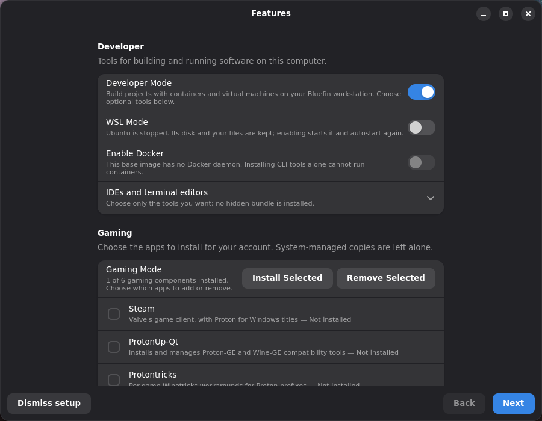
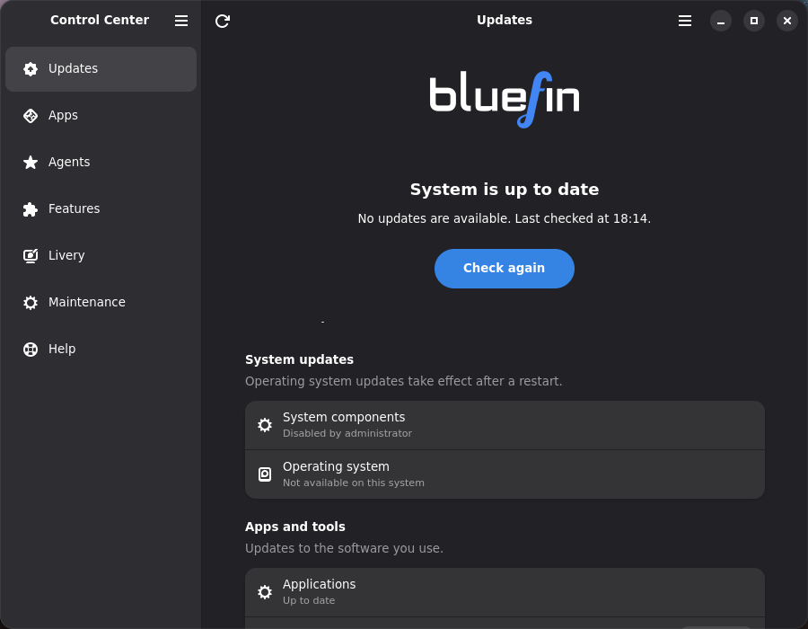
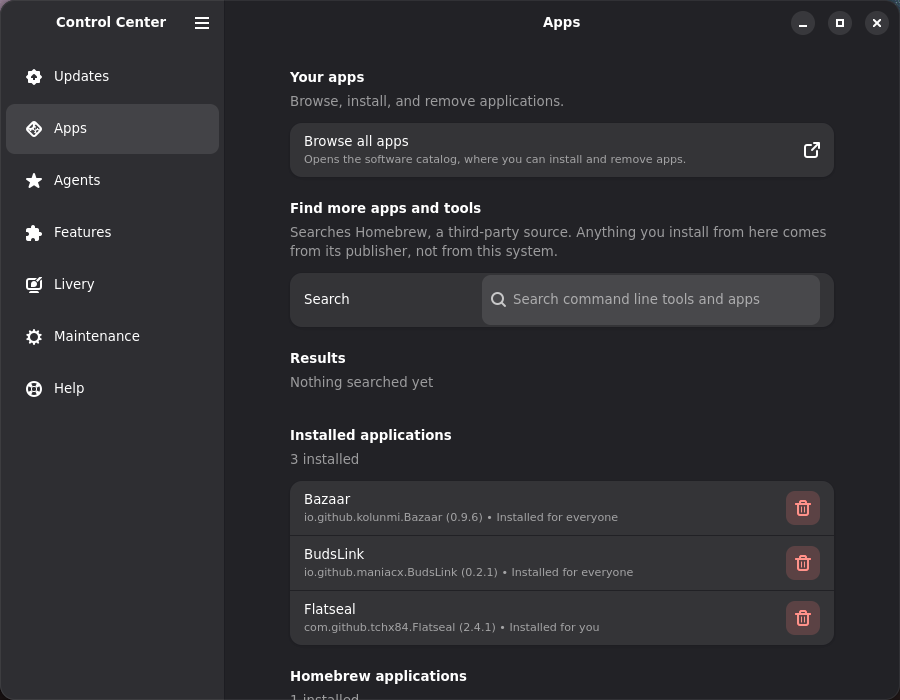
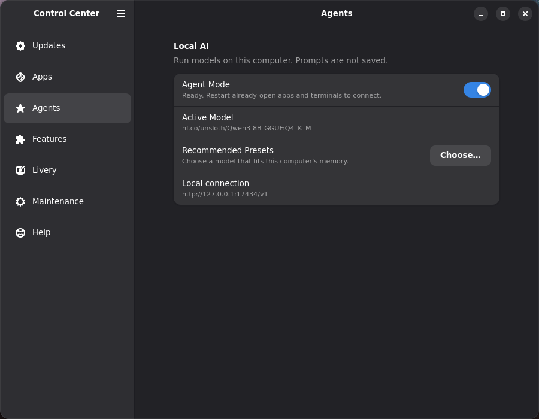
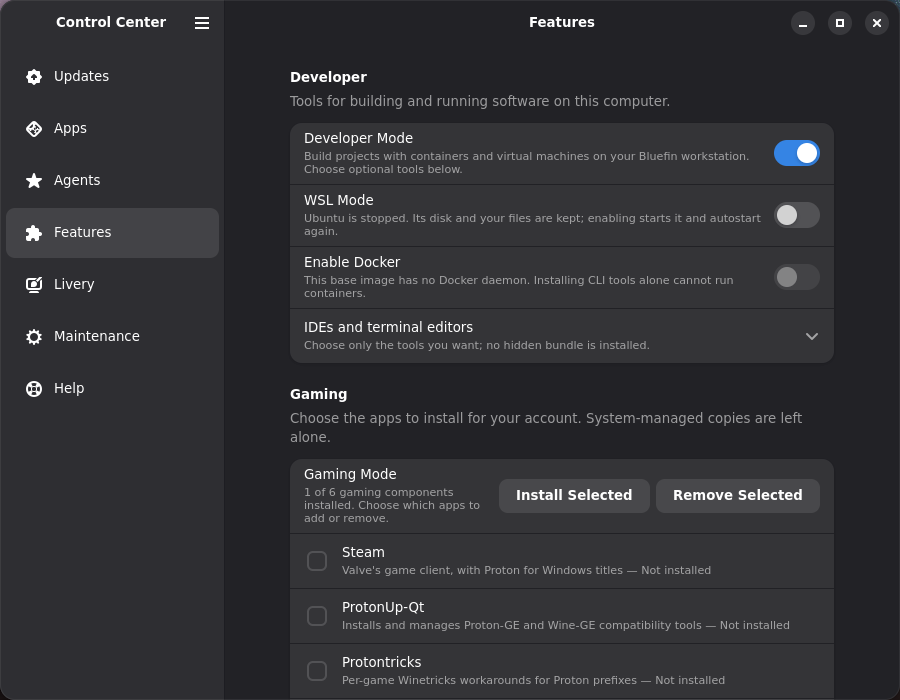
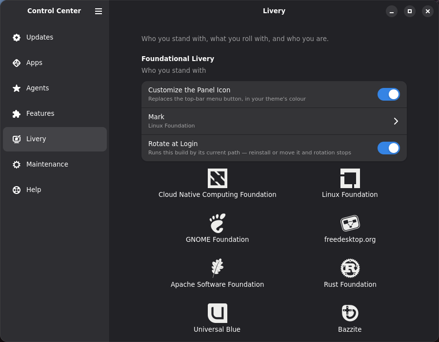
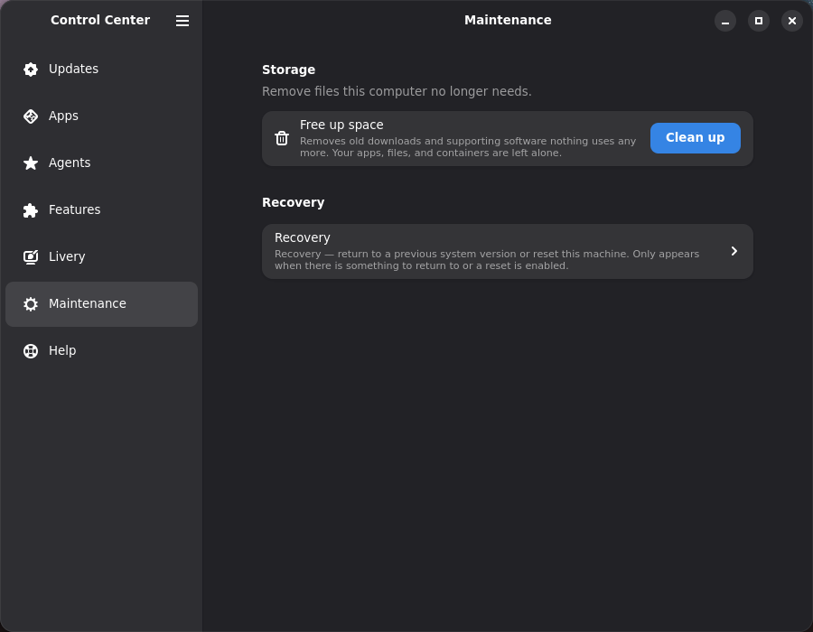
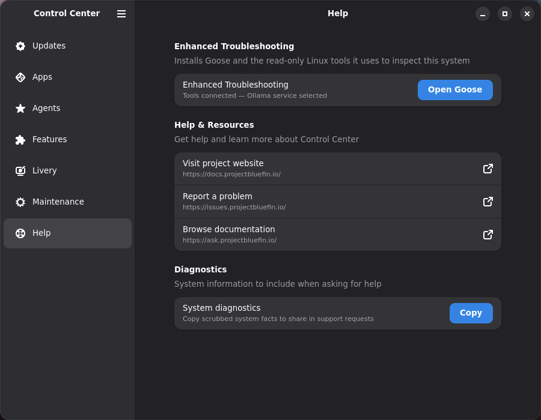

# Control Center walkthrough

Every screen below was captured from the real application in an isolated
Dakota Wayland session on 2026-10-01 — not mockups. The regular release
capture command remains documented [below](#how-these-are-made).

One app for the Bluefin family (Bluefin, Bluefin LTS, Dakota).
Everything here is one control per decision — no strategy pickers, no
schedule choosers, no feature grids.

---

## Setup Assistant



Setup Assistant never opens automatically. Choose **Setup Assistant…** from
the menu, `chairlift --setup`, or its `--first-run` alias to walk the existing
**Features**, **Apps**, **Agents**, and **Livery** pages in that order. The
first screenshot shows Features, not a welcome dialog. Pages unavailable on
this computer are skipped. The ordinary page controls perform every action;
**Back** and **Next** only navigate. **Finish** remembers completion, and
**Dismiss** remembers a skip without undoing a previous completion.

---

## Updates



The Bluefin wordmark leads the page. **System updates** groups System
components and Operating system; **Apps and tools** groups Applications and
Developer tools. Each row shows its own state, so you can see which source
is holding you up without opening anything. A source your administrator
turned off says **Disabled by administrator**; one this computer has no
software for says **Not available on this system** instead.

Normally the page also reports **System is up to date**, or how many updates
are waiting. When only a restart remains, that status panel disappears
entirely, including its padding: the wordmark is followed directly by
**System updates**, as shown above.

One button covers all of them. It reads **Check again** when nothing is
pending, **Update all** when something is, and **Retry failed** if a source
didn't finish. A staged system version adds its own **Restart now** to the
right of the **Operating system** row; the source that fails does not stop
the others. A run long enough that you wandered off finishes with a desktop
notification.
While checking or installing, an animated activity bar stays moving even
when the underlying tool has no new output. It does not claim a percentage.

Everything else on the page sits below the sources, each part only where it
applies (not all of it fits in the shot above).

**Automatic updates** is the one switch for whether this system keeps itself
up to date in the background. It appears only on systems that ship the
unattended-update timer, and it's a choice about the future — updating right
now is the button above.

**Your system** is a compact line saying what's installed now and what's
queued for the next restart; the exact build identifiers sit behind
**Details** for when you need to quote them in a bug report.

On systems that update as a whole, **Operating system** holds
**System Updates**, which downloads the next system version by itself, and
**What's changing**, which lists exactly what software a pending update will
add, remove, or upgrade once you press **Compare**. **Roll Back** — returning to
the previous version if an update went badly — lives under **Recovery**, and
only appears where a previous deployment actually exists.

Each other source keeps its own group for when you want to update just one
thing: **Apps** lists the Flatpak updates waiting, and **Developer tools**
lists the command-line tools you installed with Homebrew, with a button to
check for new versions. If a Homebrew package came from an unofficial source,
**Unverified sources** asks you to trust that source before it will keep
updating it.

**Advanced** sits last and holds the two choices that replace the operating
system itself, because both land through an update and both need a restart.
The Release Channel switch, **Get updates early**, moves between the stable
version and the early one, and **Graphics driver** switches you to the NVIDIA
driver if your card wants it. Neither offers a change unless there is
actually something to switch to.

There is no separate System page. What this computer *is* — its name, memory,
disk, and hardware — is GNOME Settings' job, and Control Center does not
duplicate it.

---

## Apps



**Browse** and **Search** lead the page; search across both Homebrew formulae
and casks. Apps already installed follow, then **App collections**, then
explicit command-line tools (the packages Homebrew manages) and export controls.
Dependency runtimes do not crowd the app inventory. Collections identify
Homebrew as a third-party source. Installs show native activity and streamed command progress
while they run, using the same controls in the explicit setup flow.

Removing an installed app asks first, and says whether
it leaves only your account or everyone's.
**Export package list** saves what
you have installed so you can put it back on another machine.
Export shows **Exporting…** and an activity spinner until it finishes, then
becomes available again, including after a failed export.

---

## Agents



**Agent Mode** is one switch that runs AI models on this computer. Answers are
generated locally — nothing you type is sent to a cloud service — and prompts
are not saved. Turning it on installs the llmman model server from Homebrew,
downloads the engine that suits your hardware, and starts it on this computer
only. Goose is the client setup path on Help. Turning it off stops the
server and keeps the software and any models you downloaded.
The row shows an activity spinner throughout setup and shutdown, then
restores the switch if the operation fails.

**Active Model** and **Recommended Presets** remain visible, becoming usable
only when the local server is ready. The connection address is directly
selectable, not hidden in Details. Apps and terminals opened after Agent Mode
is on receive `OLLAMA_HOST`; already-open ones need restarting. Everything
here runs in your own account, without an administrator password.

---

## Features



**Desktop integrations** offers **Tailscale Integration** and **Sync Folder
Integration** switches for GNOME Quick Settings. Tailscale's initial switch
position is on and Sync Folder's is off; once GNOME answers, the switches show
its actual saved choices. Sync Folder is marked as not ready yet. A missing
extension or GNOME session leaves its control unavailable and explains why.
Changing a switch enables or disables that extension for your account; it does
not install software or start Tailscale or Sync Folder services. Preview mode
leaves GNOME preferences unchanged.

**Developer tools** lets you run containers and virtual machines, and use USB
and serial hardware, without being asked for permission each time. It needs
your administrator password, and takes effect after you log out and back in.
A distribution may also configure it to install the Pulp feed reader and stage
a curated list of developer feeds in your home folder once you switch it on —
both are off by default, and turning Developer tools back off never removes the
reader, the file, or anything you imported from it.
Developer options also offer **WSL Mode** (Ubuntu LTS in Lima), **Enable
Docker**, and individually selected IDEs and terminal editors, including one
JetBrains Toolbox entry. WSL needs hardware virtualization and access to
`/dev/kvm`; permission grants require a new login. Docker needs the base
image's daemon and a socket this session can actually access; installing CLI
tools is not readiness. Missing installed helper actions leave the affected
switch visible but locked with its prerequisite explained.
**Gaming** lets you select individual applications and tools. Installed states
distinguish applications from runtime extensions and user from system scope.
Only selected user-scope entries can be removed. Partial failures stay visible
instead of being reported as an all-or-nothing success.
**Printers** is one switch per printer driver family — Ghostscript, HP
(HPLIP), and Gutenprint — for printers that need more than built-in
driverless printing. Each runs as a small container in your own account,
adds nothing to the system, and shares its printers with this computer and
your network; when one is running, its row names the local web page where you
add and manage printers. The switches are locked for now, and each row says
why: a family can be turned on only once its driver image accepts an
administrator credential for that web page, so nothing on your network can
reach an unprotected administration screen. Printing through a real device
has not yet been verified against hardware.
**Optional features** is the distribution's own feature manager; it is hidden
where the distribution ships none. When a computer offers none of these —
no Developer tools, no Gaming, no Printers, no optional features — the page
says **Nothing to set up here** rather than showing an empty screen.

Agent Mode has its own **Agents** page, and Enhanced Troubleshooting is on
**Help**.
Developer and Gaming actions show an activity spinner while their changes
are running, and errors are shown immediately rather than hidden behind an
older message.

---

## Livery



Who you are, who you stand with, and what you roll with.
Every foundation, Files/dock, profile-picture, and app-grid choice has a visual
preview. Search results fetch artwork for at most twelve visible catalog entries;
searching the rest does not download the whole catalog. Rotation changes the real
login schedule with its preferences, and a failed save restores confirmed state.


**Profile Picture** is the picture on your login and lock screens. Pick one of
Project Bluefin's dinosaurs and Control Center downloads that one illustration
to preview it; nothing changes until you press Apply. If the download or the
change fails, the chooser says so and your old picture stays put. Where
AccountsService is unavailable the picture is saved to your home folder
instead and appears after you next sign in, and the confirmation says which of
the two happened.

**App Grid Livery** is your own mark on the Show Applications button on
GNOME. On KDE Plasma, the same chooser updates each configured Kickoff applet;
if no Kickoff applet is present, the group reports unavailable instead of
pretending the setting can be applied. Search all 3,461 brands
[Simple Icons](https://simpleicons.org/) publishes — your project, your
employer, whatever you answer to — and Control Center fetches the one you pick.
You set it once; it never changes on its own, because a personal mark that
rotated would stop being personal. Turning the mark off resets the Kickoff applet
to Plasma's default icon.

On GNOME, **Foundational Livery** puts a foundation's mark in the top bar:
CNCF, the Linux Foundation, GNOME, freedesktop.org, Apache, Rust, Universal
Blue, Bazzite, Aurora, or the Open Gaming Collective. This section is omitted
on Plasma, which has no corresponding top-bar surface. On a gaming image the
collective's mark is the one you start with, since that is whose work the
image ships — pick any other and it stays picked.
Apache uses the foundation's current official oak-leaf mark, shown in monochrome
like the other symbolic choices.

**Dock Livery** marks the Files icon on GNOME or Dolphin on KDE Plasma with
the project you actually work on. Every CNCF project that publishes artwork
is in the list — 214 of them, Kubernetes through bootc — so the picker searches
rather than scrolls, and each one arrives as the project's own colour icon
straight from
[cncf/artwork](https://github.com/cncf/artwork).

Both can **Rotate at Login**, which moves one step down the list each time you
sign in — so you stand somewhere slightly different every day without ever
picking again.

Any section will also take an SVG of your own, which is the way in for
anything not on the list.

Three things worth knowing. The top-bar section needs the Custom Command Menu
GNOME extension; without it the section is not shown at all rather than
offering a control that does nothing. On GNOME, the Files mark is shared
everywhere — the dock, the app grid, the window switcher — because GNOME keeps
one icon per app, not one per place; Plasma's Dolphin is a separate surface.
Only the Files icon is in colour: GNOME's top bar and app-grid glyph draw
single-colour silhouettes, recoloured to match your theme.

On GNOME, turning a section off puts back exactly what was there before,
including a mark your distribution set rather than one you chose. KDE Plasma
app-grid reset behavior is being completed separately.

---

## Maintenance



One button. **Free up space** removes old downloads and supporting software
nothing uses any more, and leaves your apps, files, and containers alone. It
tells you how much it reclaimed only when it could measure it. An activity
spinner remains visible while cleanup is running. Below it sit any
**Maintenance tasks** whoever set up this computer added. **Recovery**
holds the actions you can't undo (under **Maintenance → Recovery**): one returns
to a previous system version, one removes the apps you installed and your
development containers, and the other reinstalls the system from scratch.
Those stay hidden normally until turned on or until a rollback exists.
Recovery also has **Published versions**, which asks the image registry for
the versions of your release stream from the last 90 days and lists one per
day, marking the one you are running and the one Roll Back returns to. It is a
list to read, not a control: nothing in it changes your system.

---

## Help



**Enhanced Troubleshooting** comes first where Homebrew is installed: it sets
up an AI assistant that can read your logs, services, and network to help
work out what's wrong, then launches it. The premade configuration chooses no
AI service; select one in Goose, and the row names the service you configured.
Setup shows activity while it runs and wires the recognized diagnostic entry
to fixed tools with SSH-key discovery disabled. It can repair that entry in
your existing Goose configuration while preserving provider, model and unrelated
settings. Already-usable configuration is left alone; unsafe or ambiguous
policies are refused rather than silently replaced.

Three links, each shown only when it is configured: **Visit project
website**, **Report a problem** (the `issues` URL, where bug reports go), and
**Browse documentation**.

A **Diagnostics** group offers a *Copy system diagnostics* row that places
scrubbed system information — OS, image, kernel, desktop, and GPU — onto the
clipboard to include when asking for help.

When the configuration turns on something this computer cannot run — Flatpak
or Homebrew is absent, or the machine is not a native A/B install — **Feature
availability** appears with one collapsed row, **Why is something missing?**,
that names each such feature and what it needs.

---

## How these are made

```bash
make screenshots
```

Builds the app, runs it inside the Dakota image on a private headless Mutter
Wayland session — the compositor Bluefin runs — and writes one PNG per page to
`docs/screenshots/`. The session's virtual monitor is the window's default
900×700, so each capture is exactly the window. Keys go through Mutter's
RemoteDesktop API and frames through its ScreenCast API. Always `--dry-run`,
so nothing on the capture machine changes. Hardware the runner doesn't have
is stubbed, and `make ci` checks no released binary can read those stubs.

The capture session has no Docker daemon and is not a booted OS-update
target, so those controls disclose their unavailability instead of
pretending an operation was tested. It needs podman and Go on the host.

Run it locally when something's appearance changes and you want to preview
before a release. It isn't regenerated per commit, since font and theme
drift would churn the repo — instead, `.github/workflows/release-screenshots.yml`
runs it automatically after each published GitHub Release (building from that
release's tag) and opens a `release-screenshots` pull request against `main`
with any changed PNGs, so what ships is what's pictured here without anyone
remembering to do it by hand. That pull request goes through the merge queue
like any other and still needs one approval. `make ci` checks
that every page and configurable group has a screenshot and an entry here.
